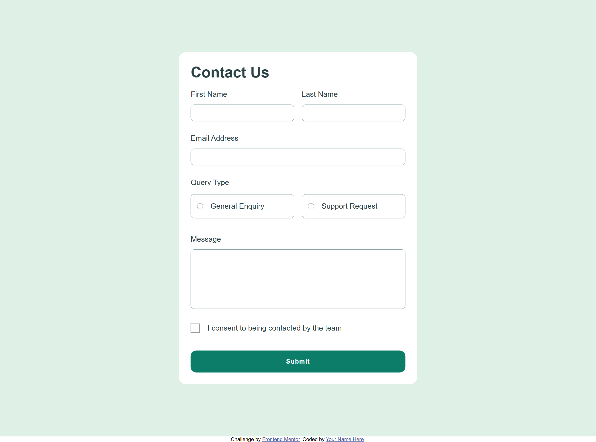

# Frontend Mentor - Contact form solution

This is a solution to the [Contact form challenge on Frontend Mentor](https://www.frontendmentor.io/challenges/contact-form--G-hYlqKJj). Frontend Mentor challenges help you improve your coding skills by building realistic projects. 

## Table of contents

- [Overview](#overview)
  - [The challenge](#the-challenge)
  - [Screenshot](#screenshot)
  - [Links](#links)
- [My process](#my-process)
  - [Built with](#built-with)
  - [What I learned](#what-i-learned)
  - [Continued development](#continued-development)
  - [Useful resources](#useful-resources)
  - [AI Collaboration](#ai-collaboration)
- [Author](#author)
- [Acknowledgments](#acknowledgments)

**Note: Delete this note and update the table of contents based on what sections you keep.**

## Overview

### The challenge

Users should be able to:

- Complete the form and see a success toast message upon successful submission
- Receive form validation messages if:
  - A required field has been missed
  - The email address is not formatted correctly
- Complete the form only using their keyboard
- Have inputs, error messages, and the success message announced on their screen reader
- View the optimal layout for the interface depending on their device's screen size
- See hover and focus states for all interactive elements on the page

### Screenshot

### Links

- Solution URL: [Solution](https://github.com/nqbinh98/contact-form)
- Live Site URL: [Live site](https://nqbinh98.github.io/contact-form/)

## My process

### Built with

- Semantic HTML5 markup
- CSS custom properties
- Flexbox
- CSS Grid
- Mobile-first workflow
- JS

### What I learned
I strengthened my skills in DOM manipulation and form validation logic using JavaScript. I gained experience in creating accessible custom form elements and utilized CSS :has() for cleaner, modern styling.

### Continued development
I plan to optimize the form submission flow by integrating an asynchronous API call to handle data. Additionally, I aim to refine the responsive layout to ensure perfect alignment across all device sizes.

### AI Collaboration
I utilized AI as a coding partner to troubleshoot CSS layout issues and debug JavaScript event listeners. The collaboration helped me identify best practices for accessible form design and efficient code refactoring.

## Author

- Github - [@nqbinh98](https://github.com/nqbinh98)
- Frontend Mentor - [@nqbinh98](https://www.frontendmentor.io/profile/nqbinh98)

## Acknowledgments
Special thanks to the Frontend Mentor community for providing this challenge. I also appreciate the guidance received during the debugging process, which significantly improved my understanding of keyboard navigation and ARIA standards.
